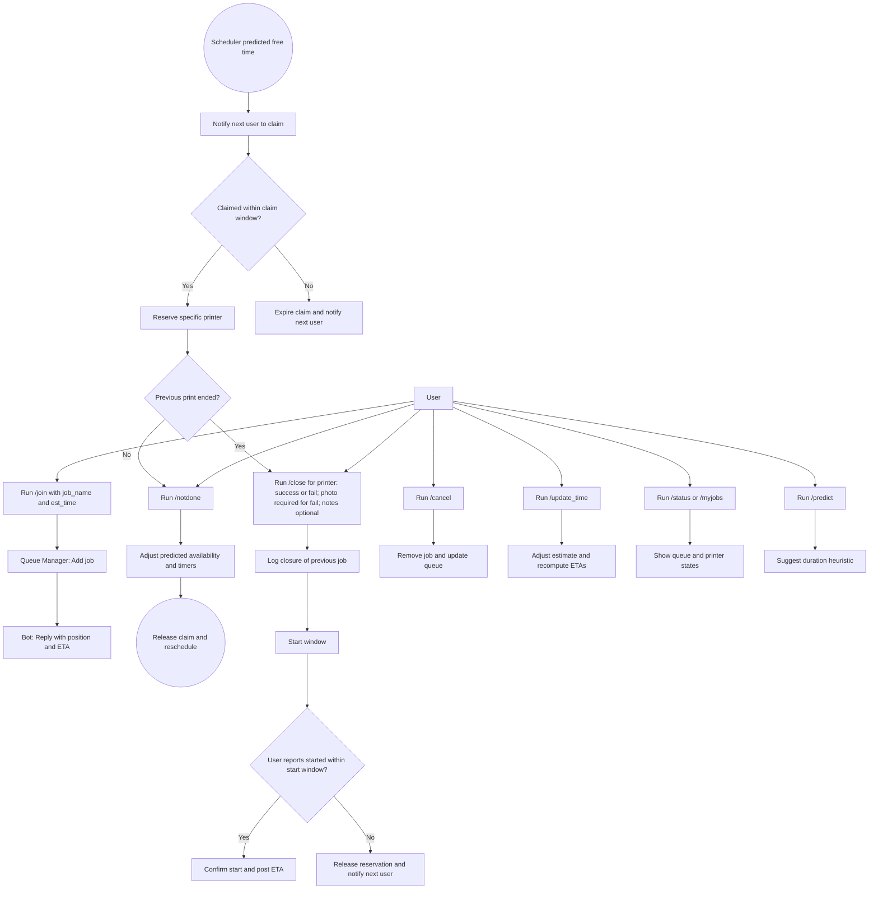

 # 3D Printer Queue + Discord Bot System — Planning Document


The following has been generated by AI and fully checked and approved by me.

 ## User-Side Workflow

**Text Description**

- **Goal** Fair, automated queue for 3× Bambu Lab X1C printers via Discord not using manual monitor
- **Join the queue** User runs `/join job_name est_time`. Bot replies with queue position and estimated wait based on active jobs and the user's self-reported print time.
- **Automatic notifications** When any printer becomes IDLE, the bot pings the next user to claim within the configured claim window. If the finish occurs outside printer access hours, the countdown begins at the start of the next access period.
- **Claim window** `/claim` within the default 20 minutes (configurable) reserves a specific printer and starts the start window. If not claimed, the bot expires the hold and pings the next user.
- **Start window** The user must run `/close` first, then `/report started` within the default 30 minutes (configurable) to confirm print start; `/report started` is blocked until `/close` is recorded. Otherwise the reservation is released and the next user is notified.
- **Access hours** If a print finishes outside configured access hours, claim/start countdowns are deferred to the beginning of the next access period.
- **Close previous job** The next user must run `/close <printer> <success|fail> [notes] [photo]` before starting; close can be done at any time (before or after `/claim`). If closing as `fail`, a photo is required; notes are optional.
- **Not done (after claim)** If the previous print is still running after you claim, run `/notdone <printer> <remaining_time>` to push the predicted availability and timers. This action immediately releases (closes) your current claim and reschedules your notification for the updated time. Must be run by the current claimer of that printer; invalid otherwise.
- **Queue commands** `/join`, `/claim`, `/close`, `/notdone`, `/report started`, `/cancel`, `/update_time`, `/status`, `/myjobs`, `/predict` (optional later: `/history`).
- **Fairness & persistence** Single shared FIFO queue across all printers. Timeouts enforce fairness. Queue state persists across restarts.



## Backend Tech Stack and Layers

**Text**

- **Runtime & Platform** macOS (Caffeinated Mac), Python 3.10+, launchd or Homebrew services, venv. Use `caffeinate` to prevent sleep.
- **Key Libraries** `discord.py` (or `nextcord`), `sqlite3` (built-in) or `aiosqlite`, `python-dotenv`, optional `APScheduler` (or asyncio timers) for scheduling.
- **Configuration** `.env` for Discord token and settings. `printers.yaml` for printer labels/IDs (no network addresses). Timeouts (configurable): claim default 20 min, start default 30 min. Access hours: if a print finishes outside access hours, start countdowns at the next access period.
- **Data Model (SQLite)**  
  - **jobs**: id, user_id, username, job_name, est_minutes, status[queued|reserved|printing|completed|failed|canceled], printer_id, created_at, claim_deadline_at, start_deadline_at, started_at, finished_at, actual_minutes, close_outcome[success|fail], closed_at, closed_by_user_id, close_notes, close_photo_url (required if close_outcome=fail).
  - **printers**: id, name, status[idle|reserved|printing], predicted_available_at, current_job_id.
  - **events**: ts, printer_id, job_id, type[notify|timeout|command|schedule|notdone|claim_release], payload(json).
- **Queue Manager Module** FIFO across all printers, persistence in SQLite, idempotent operations, recompute ETAs using user self-reported `est_minutes`, maintain per-printer `predicted_available_at`, process `/notdone` by updating predicted availability, releasing the current claim, and rescheduling notifications; record manual closures via `/close`; block `/report started` until the latest job for that printer is closed; enforce configurable (more forgiving) claim/start timeouts; respect access hours by deferring countdowns to the next access period; crash-safe recovery on restart; concurrency-safe reservations.
- **Discord Bot Module** Slash commands `/join /claim /close /notdone /report started /cancel /update_time /status /myjobs /predict`. Validation: `/notdone` only by current claimer for that printer and it releases the current claim; if `/close fail`, require a photo attachment. Post notifications to a channel and mention users. Guard rails (rate limits, permission checks for admins).
- **Scheduler/Main Loop** Async tasks: scheduler/timeouts and notifier (no printer polling). Event bus (in-process) to coordinate modules and trigger predicted-availability notifications.
- **Logging & Analytics** Append to `events` and record actual durations. ETAs use self-reported times; optional later: analytics/prediction (e.g., median/EMA) and `/history`.
- **Deployment** Single process on a Caffeinated Mac. Use launchd or Homebrew services to auto-start and restart on failure; run with `caffeinate` to keep the Mac awake; use `newsyslog` (or similar) for log rotation.
```mermaid
flowchart LR
  USR[Discord Users] --> BOT[Discord Bot Module]
  BOT <--> QM["Queue Manager\n(ETAs, Timeouts, Persistence)"]
  QM <--> DB[(SQLite)]
 flowchart LR
   USR[Discord Users] --> BOT[Discord Bot Module]
   BOT <--> QM["Queue Manager\n(ETAs, Timeouts, Persistence)"]
   QM <--> DB[(SQLite)]

   subgraph Core Services
     SCH[Timeout Scanner and Scheduler]
     PRED["ETA Predictor (self-reported)"]
     EVT[Event Log and Analytics]
   end

   SCH --> QM
   PRED --> QM
   QM --> BOT
   QM --> EVT
   BOT --> EVT
 ```
